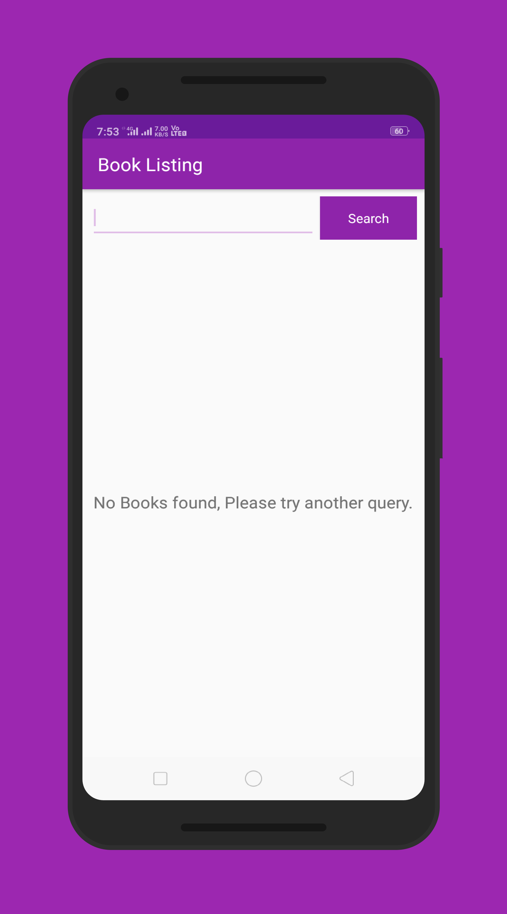
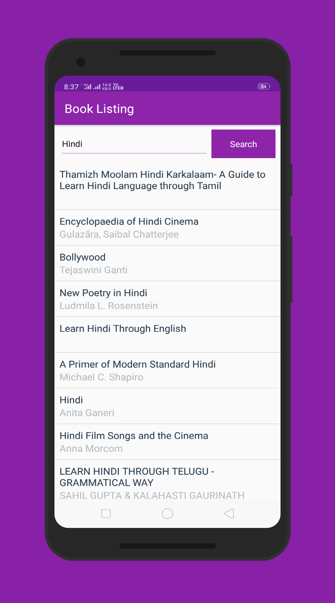

# BookListing
The goal is to design and create the structure of a Book Listing app which would allow a user to get a list of published books on a given topic. I've used the google books api in order to fetch results and display them to the user.

#### What I've learned from this project?
This project is about combining various ideas and skills I’ve been practicing throughout the course. They include:

* Fetching data from an API
* Using an AsyncTask
* Parsing a JSON response
* Creating a list based on that data and displaying it to the user.

## Screenshots

&ensp;
